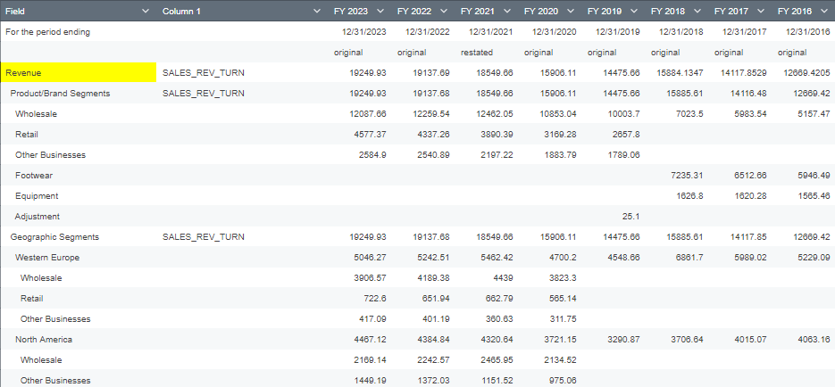

# Financial Analysis and Forecasting Project

## Overview
This project focuses on analyzing financial data extracted from Bloomberg for the years 2016-2023. The primary aim is to study revenue trends, operating expenses, profit margins, and project the financial outlook for 2024-2025 using different scenarios (base, strong, weak). The project uses dynamic visualizations to clearly represent the data and forecast models to predict future performance under varying market conditions.

## Project Components
The project consists of several key elements:

1. **Data Source**  
   The data is extracted from Bloomberg and covers financial performance indicators such as:
   - Revenue segmented by wholesale, retail, and other businesses
   - Operating expenses, gross profits, and EBIT (Earnings Before Interest and Taxes)
   - Financial metrics including profit margins and revenue growth rates

   

2. **Profit & Loss (P&L) Statement**  
   A detailed P&L statement is provided, breaking down the revenue streams and operating expenses, offering insights into the business’s overall performance over the years.

3. **Forecast Models**  
   Three scenarios—base, strong, and weak—are built to predict future financial performance for 2024 and 2025:
   - **Base Case**: Assumes moderate revenue growth and stable expenses.
   - **Strong Case**: Assumes higher-than-average revenue growth and improved efficiency in operating expenses.
   - **Weak Case**: Assumes lower revenue growth with potential increases in operating costs.

4. **Dynamic Dashboards & Visualizations**  
   The project includes:
   - **Revenue over Time (Historical vs. Forecast)**: Line chart comparing actual revenue to projected figures.
   - **EBIT Over Time (Historical vs. Forecast)**: Line chart illustrating EBIT changes over the years and forecasted figures.
   - **Revenue Growth & Profit Margins**: Charts tracking growth and margins in each scenario.
   - **Scenario Analysis Dashboard**: A visual representation of Revenue, Gross Profit, and EBIT under different forecast scenarios for 2024.
     
5. **Insights Page**  
   The key findings based on growth and profitability analysis for each forecast scenario.
   

## How to Explore the Project

1. **Spreadsheet Access**  
   A comprehensive spreadsheet is available that contains all the raw data, analysis, and forecast calculations. You can dive into the data to understand how each metric was derived.

   - [[Project Details](https://docs.google.com/spreadsheets/d/1BiD8oHuSKxSh-g2shcsBQtCunnF_q8RNGCYodlP9o6k/edit?usp=sharing)]

2. **Video Walkthrough**  
   A short video accompanies this project, walking you through the key insights, charts, and forecasts in a simplified, visual format.
   - [[Project Walkthrough](https://www.linkedin.com/feed/update/urn:li:activity:7254109474586542080/)]

## Insights & Key Findings

- **Revenue Growth**: Historical revenue growth has been stable across wholesale and retail segments. The strong case forecast shows a potential increase in revenue growth, driven primarily by the retail sector.
- **EBIT Performance**: EBIT has seen consistent improvement, and the forecasted strong case scenario suggests further growth due to operational efficiencies.
- **Profit Margins**: Gross profit margins have been stable, with the base case projecting a moderate increase, while the weak case shows a potential slight decline in profitability.

## Tools Used
- **Google Sheets**: For data manipulation, analysis, and building forecast models.
- **Bloomberg**: Source of historical financial data.

## How to Use this Project
1. **View the Video**: Watch the walkthrough video to get an overview of the insights.
2. **Explore the Data**: Download the spreadsheet to see the underlying financial data and forecasts.
3. **Examine the Dashboards**: Interact with the dynamic visualizations to understand how different scenarios impact the future performance.

## Contact & Feedback
If you have any questions, comments, or suggestions, feel free to reach out or leave feedback. I’d love to hear your thoughts!
